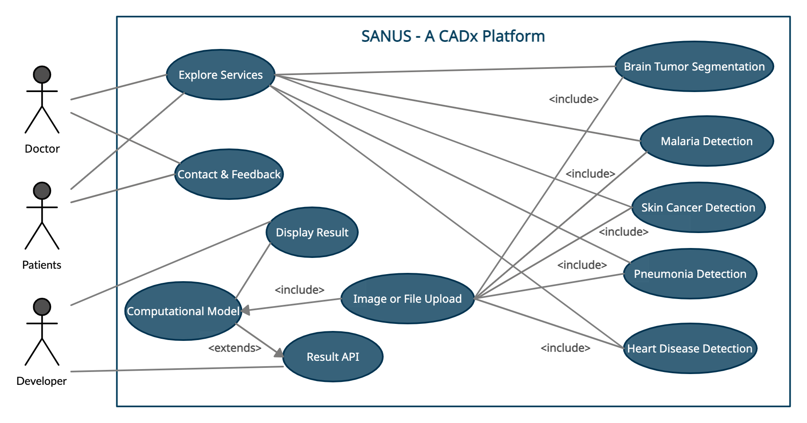

# SANUS - A Cadx Platfrom


## Description
SANUS is a Computer Aided Diagnostic Platform where people can diagnose their diseases with one click. We use Deep Learning and Machine Learning techniques to detect the pattern of various disease with the patient electronic healthcare records and provide information of various anomalies. In our platform we are tackling five major diseases for now, thses are Brain Tumor Detection using U-Net, Malaria Detection, Skin Cancer, Heart Disease and Pneumonia Detection using CT Scan. We have applied different state of art models to achieve a good accuracy of our models. Our target audience are the people who want fast medical checkups. As we all know, internet is available to majority of the people and they can go and conduct test. Doctors who want to recommend patients for their illness online as the  process will be more easier with no loss of any medical documents. Some of the unique features of our project. It is user friendly. We can get instant report of the diagnosis. Light Weighted Machine Learning and Deep Learning Models are used. It provides a multi-platform support.

## Project Demo
[Youtube Link](https://youtu.be/btGCzlapTsE)

## Our Services
1. Malaria Detection
2. Brain Tumor Detection
3. Heart Disease Prediction
4. Pneumonia Detection
5. Skin Cancer Detection

## Unique Features
1. User Friendly.
2. Get instant report of the diagnosis.
3. Light Weighted Machine Learning and Deep Learning Models.
4. Provides a multiplatform support.

## Target Audience
* Our target audience are the people who want fast medical checkups. As we all know, internet is available to majority of the people and they can go and conduct test.
* Doctors who want to recommend patients for their illness online as the  process will be more easier with no loss of any medical documents

## Project Structure
```
.
├── Backend
├── Frontend    
├── README.md
└── SANUS.png
```

## How to run this 
1. Open your terminal
2. git clone https://github.com/SANUS-ML/SANUS-WEB.git
3. cd SANUS-WEB
4. To run the Backend Code. [Click Here](https://github.com/SANUS-ML/SANUS-WEB/blob/master/Backend/README.md)
5. To run the Frontend Code. [Click Here](https://github.com/SANUS-ML/SANUS-WEB/blob/master/Frontend/README.md)


## High Level Architecture Diagram


## Technological Stack Used
* **Html5, Css3, ReactJs** and **Bootstrap** for making the frontend of the website.
* **Tensorflow and Keras** for creating deep learning models.
* **Flask** for creating the backend server to predict the result of the test.

## Future Aspect
1. Make a flutter app to get reports within the app. Use TF-Lite models to deploy them locally on edge devices.
2. To use Docker so that it becomes more scalable.
3. To add new diagnosis features.
4. To recommend nearby hospitals and doctors to the patient.

## Contributors
* [Sayan Nath](https://sayannath.biz)
* [Sambit Kumar Majhi](https://github.com/sambitraze)
* [Manish Bharadwaj](https://github.com/2221mb)
* [Taranpreet Singh Chabbra](https://github.com/singhtaran1005)
